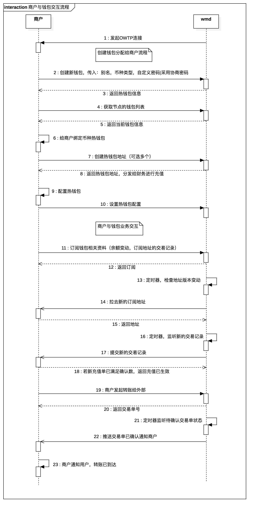

# OpenWallet商户接口V1

[TOC]

## 修订信息

| 版本  | 时间       | 修订人        | 修订内容                   |
|-------|------------|---------------|----------------------------|
| 1.0.0 | 2018-06-09 | 麦志泉，梁东炘 | 创建文档                   |
| 1.0.1 | 2018-07-02 | 麦志泉        | 新增获取订阅地址版本信息   |
| 1.0.2 | 2018-07-04 | 麦志泉        | 通信协议抽象为OWTP协议说明 |
| 1.0.3 | 2018-07-07 | 麦志泉        | 补充流程说明，新增相关方法  |

---

## 1 概述

本文档编写目的为说明OpenWallet商户API与钱包管理工具的安全通信协议。
通信协议底层基于websocket，由商户SDK建立API服务，钱包主动发起连接服务，在安全机制下进行消息交互。
商户的业务系统可通过SDK订阅需要的数字货币钱包数据内容，钱包管理工具根据订阅指令，推送数据给商户SDK。

## 2 通信协议

钱包与商户的业务接口交互基于OWTP协议进行实现。详细查看[《OWTP协议框架设计》](./OWTP协议框架设计.md)

## 3 钱包管理接口方法

### 3.1 订阅方法 `subscribe`

由商户向钱包方调用需要订阅的内容

**请求参数**

| 参数名称      | 类型           | 是否可空 | 描述               |
|---------------|----------------|----------|--------------------|
| subscriptions | [Subscription] | 否       | 订阅数组           |

#### 订阅内容 `Subscription`

| 参数名称 | 类型   | 是否可空 | 描述                                                                    |
|----------|--------|----------|-------------------------------------------------------------------------|
| type     | int    | 否       | 订阅类型，1：钱包余额，2：充值记录，3：汇总日志                               |
| coin     | string | 否       | 订阅的币种钱包类型                                                      |
| walletID | string | 否       | 钱包账户id，创建钱包获得，可与钱包主机里的钱包账户关联，也可与订阅地址关联 |

`请求实例`

```json

{
    "subscriptions":[
        {
            "coin": "btc",
            "type": "1",
            "walletID": "MYWALLET",
        },
        {
            "coin": "btc",
            "type": "2",
            "walletID": "MYWALLET",
            "version": 1565645356,
        },
        {
            "coin": "btm",
            "type": "3",
            "walletID": "MYWALLET",
        },
    ]
}

```

`响应实例`

```json

{

}

```

### 3.2 钱包工具配置接口 `configWallet`

商户向wmd设置某个币种钱包的参数。

**请求参数**

| 参数名称 | 类型   | 是否可空 | 描述                                                           |
|----------|--------|----------|----------------------------------------------------------------|
| coin     | string | 否       | 币种                                                           |
| walletID | string | 否       | 钱包ID                                                         |
| surplus  | string | 否       | 剩余额，设置后，【余额—剩余额】低于第一笔提币金额则不提币(默认为0) |
| fee      | string | 否       | 提币矿工费                                                     |
| confirm  | int    | 否       | 确认次数(达到该确认次数后不再推送确认，默认30)                  |

`请求实例`

```json

{
    "coin": "btc",  
    "walletID": "MYWALLET",
    "surplus": "10000",
    "fee": "100000",
    "confirm": 30,
}

```

`响应实例`

```json

{

}

```

### 3.3 获取钱包列表 `getWalletList`

获取节点所提供的钱包列表

**请求参数**

| 参数名称 | 类型     | 是否可空 | 描述         |
|----------|----------|----------|--------------|
| coin     | string   | 否       | 币种         |

**响应参数**

| 参数名称 | 类型     | 是否可空 | 描述         |
|----------|----------|----------|--------------|
| wallets  | [Wallet] | 否       | 钱包信息数组 |

#### 钱包信息 `Wallet`

| 参数名称   | 类型     | 是否可空 | 描述                                                           |
|------------|----------|----------|----------------------------------------------------------------|
| coin       | string   | 否       | 币种                                                           |
| alias      | string   | 否       | 钱包别名                                                       |
| walletID   | string   | 否       | 钱包ID                                                         |
| publicKeys | []string | 是       | 钱包公钥，多签钱包资产账户公钥会有多条                          |
| balance    | string   | 否       | 余额                                                           |
| surplus    | string   | 否       | 剩余额，设置后，【余额—剩余额】低于第一笔提币金额则不提币(默认为0) |
| fee        | string   | 否       | 提币矿工费                                                     |
| confirm    | int      | 否       | 确认次数(达到该确认次数后不再推送确认，默认30)                  |

`响应实例`

```json

{
    "coins":
    [
        {
            "coin":"btc",
            "walletID": "ADFVSDF",
            "balance":"598443",
            "alias": "MYWALLET",
            "publicKey": "sdfsf",
        },
    ]
}

```

### 3.4 提交转账交易 `submitTransaction`

商户向钱包工具发起提币，可以发起多笔提币输出，钱包工具自动组合成多输出交易单

**请求参数**

| 参数名称    | 类型      | 是否可空 | 描述                              |
|-------------|-----------|----------|-----------------------------------|
| withdraws   | [Object]] | 否       | 所需提币条目 （每个为一个withdraw） |
| -> coin     | string    | 否       | 币名                              |
| -> walletID | string    | 否       | 每次返回的代提币条目数（1-50       |
| -> sid      | string    | 否       | 安全id（防止重复提交）              |
| -> isMemo   | int       | 否       | 1为memo，0为address                |
| -> address  | string    | 否       | 地址（账号）                        |
| -> amount   | string    | 否       | 提笔金额                          |
| -> memo     | string    | 是       | 备注                              |
| -> password | string    | 是       | 解锁钱包密码                      |

`请求实例`

```json

 {
    "withdraws":[
         {
             "sid":"4343",
             "address":"bm1q3dmwc4ldxghfep98easlktv4lewy5n489hwsr3",
             "amount":"323.44",
             "isMemo":0,
             "memo":"",
             "coin":"btc",
             "walletID":"MYWALLET",
         },
         {
             "sid":"4344",
             "address":"bm1q3dmwc4ldxghfep98easlktv4lewy5n489hwsr3",
             "amount":"111.44",
             "isMemo":0,
             "memo":"",
             "coin":"btc",
             "walletID":"MYWALLET",
         },
    ],
}
 
```

**响应参数**

| 参数名称   | 类型      | 是否可空 | 描述                   |
|------------|-----------|----------|------------------------|
| withdraws  | JSONArray | 否       | 交易单数组             |
| -> sid     | string    | 否       | 安全id                 |
| -> txid    | string    | 否       | 交易单id，id为空则失败  |
| -> status | uint      | 否       | 1：成功, >1：失败，2：重复sid |
| -> reason  | string    | 否       | 失败原因               |

`响应实例`

```json

{
    "status": 0,
    "msg": "success",
    "result": {
         "withdraws":[
         {
             "sid":"4343",
             "txid":"bm1q3dmwc4ldxghfep98easlktv4lewy5n489hwsr3",
             "status": 2,
             "reason": "double spend",
         },
         {
             "sid":"4343",
             "txid":"bm1q3dmwc4ldxghfep98easlktv4lewy5n489hwsr3",
             "status": 1,
             "reason": "",
         },
         ]
    },
}

```

### 3.5 创建钱包 `createWallet`

商户创建钱包，一般用于商户管理热钱包

**请求参数**

| 参数名称     | 类型   | 是否可空 | 描述                    |
|--------------|--------|----------|-------------------------|
| coin         | string | 否       | 币种标识                |
| alias        | string | 否       | 钱包别名                |
| passwordType | uint   | 否       | 0：自定义密码，1：协商密码 |
| password     | string | 是       | 自定义密码              |
| authKey    | string | 是       | 授权公钥                |

`请求实例`

```json
{
    "coin": "btc",  
    "alias": "go_wallet",
    "passwordType": 0,
    "password": "123456"
}

```

**响应参数**

| 参数名称  | 类型      | 是否可空 | 描述                    |
|-----------|-----------|----------|-------------------------|
| wallet | Wallet | 否       | 钱包信息数组 |

`响应实例`

```json

{
    "coin":"btc",
    "walletID": "MYWALLET",
    "balance":"598443",
}

```

### 3.6 创建地址 `createAddress`

创建钱包地址，地址一般用于热钱包的充值

**请求参数**

| 参数名称 | 类型   | 是否可空 | 描述         |
|----------|--------|----------|--------------|
| coin     | string | 否       | 币种标识     |
| walletID | string | 否       | 钱包ID       |
| count    | uint   | 否       | 条数         |
| password | string | 是       | 钱包解锁密码 |

`请求实例`

```json
{
    "coin": "btc",  
    "walletID": "121212",
    "password": "123132",
}

```

**响应参数**

| 参数名称  | 类型      | 是否可空 | 描述     |
|-----------|-----------|----------|----------|
| addresses | [Address] | 否       | 地址数组 |

#### 地址信息 `Address`

| 参数名称 | 类型   | 是否可空 | 描述                  |
|----------|--------|----------|-----------------------|
| address  | string | 否       | 币种                  |
| alias    | string | 是       | 别名，可以是用户的id号 |
| walletID | string | 否       | 钱包ID                |
| balance  | string | 否       | 余额                  |
| isMemo   | bool   | 是       | 是否memo              |
| memo     | string | 否       | 备注                  |

`响应实例`

```json

{
    "addresses": [
        {
            "coin":"btc",
            "walletID": "MYWALLET",
            "balance":"598443",
            "isMemo": false,
            "memo": "ABC",
            "alias": "11212",
        },
    ]
}

```

### 3.7 获取地址列表 `getAddressList`

获取钱包地址，一般用于给财务查看热钱包地址

**请求参数**

| 参数名称 | 类型   | 是否可空 | 描述     |
|----------|--------|----------|----------|
| coin     | string | 否       | 币种标识 |
| walletID | string | 否       | 钱包ID   |
| offset    | uint   | 是       | 从0开始     |
| limit    | uint   | 是       | 查询条数     |

`请求实例`

```json

{
    "coin": "btc",  
    "walletID": "121212",
    "offset": 0,
    "limit": 20,
}

```

**响应参数**

| 参数名称  | 类型      | 是否可空 | 描述     |
|-----------|-----------|----------|----------|
| addresses | [Address] | 否       | 地址数组 |

`响应实例`

```json

{
    "addresses": [
        {
            "coin":"btc",
            "walletID": "MYWALLET",
            "balance":"598443",
            "isMemo": false,
            "memo": "ABC",
        },
    ]
}

```

## 4 商户服务接口方法

### 4.1 获取订阅地址版本信息 `getChargeAddressVersion`

**请求参数**

| 参数名称 | 类型   | 是否可空 | 描述     |
|----------|--------|----------|----------|
| coin     | string | 否       | 币名     |
| walletID | string | 否       | 钱包ID   |

`请求实例`

```json

{
    "coin": "btc",
    "walletID": "23123",
}

```

**响应参数**

| 参数名称 | 类型   | 是否可空 | 描述   |
|----------|--------|----------|--------|
| coin     | string | 否       | 币名     |
| walletID | string | 否       | 钱包ID   |
| total    | int    | 否       | 总数量 |
| version  | string | 否       | 版本号 |

```json

{
    "coin": "btc",
    "walletID": "23123",
    "total": 22000,
    "version": 1122,
}

```

### 4.2 获取订阅的地址表 `getChargeAddress`

若商户订阅了充值记录推送，钱包管理工具会去下载商户的要订阅的地址列表
通过偏移量

**请求参数**

| 参数名称 | 类型   | 是否可空 | 描述     |
|----------|--------|----------|----------|
| coin     | string | 否       | 币名     |
| walletID | string | 否       | 钱包ID   |
| offset   | int    | 否       | 偏移量   |
| limit    | int    | 否       | 读取条数 |

`请求实例`

```json

{
    "coin": "btc",
    "walletID": "23123",
    "offset": 0,
    "limit": 200,
}

```

**响应参数**

| 参数名称  | 类型      | 是否可空 | 描述                    |
|-----------|-----------|----------|-------------------------|
| addresses | [Address] | 否       | 地址参数(内容为address) |

`响应实例`

```json

{
    "addresses": [
        {
            "address": "1N5GUkhhvYYAMBSSqdc9EkiqSxAY4Pd19y",
            "isMemo": false,
            "memo": "ABC",
        }
    ],
}

```

### 4.3 提交充值到账记录 `submitRechargeTrasaction`

**请求参数**

| 参数名称  | 类型          | 是否可空 | 描述                             |
|-----------|---------------|----------|----------------------------------|
| coin      | string        | 否       | 币名                             |
| walletID  | string        | 否       | 钱包ID，由商户定义，与订阅地址关联 |
| recharges | [Transaction] | 否       | 充值列表                         |

#### 交易单 `Transaction`

| 参数名称    | 类型   | 是否可空 | 描述                                                 |
|-------------|--------|----------|------------------------------------------------------|
| txid        | string | 否       | 唯一交易单号                                         |
| from        | string | 否       | 发送地址                                             |
| to          | string | 否       | 接收地址                                             |
| amount      | string | 否       | 充值金额                                             |
| confirm     | int    | 否       | 确认数                                               |
| blockHash   | string | 否       | 区块哈希                                             |
| blockHeight | string | 否       | 区块链高度（可以是组合高度例如ada 53_11323，poch_slot） |
| isMemo      | int    | 否       | 1为memo，0为address                                   |
| memo        | string | 否       | 备注                                                 |

`请求实例`

```json

{
	"coin": "BTM",
	"walletID": "MYWALLET",
	"recharges": [{
			"txid": "ajdiojauwiefj...",
			"from": "bm1q3dmwc4ldxghfep98easlktv4lewy5n489hwsr3",
			"to": "bm1q3dmwc4ldxghfep98easlktv4lewy5n489hwsr2",
			"amount": "1.2332",
			"confirm": 0,
			"blockHash": "daiosdjioqjwoejjeijisa...",
			"blockHeight": "daiosdjioqjwoejjeijisa...",
			"isMemo": 0,
			"memo": "",
		},
		{
			"txid": "ajdiojauwiefj...",
			"from": "bm1q3dmwc4ldxghfep98easlktv4lewy5n489hwsr3",
			"to": "bm1q3dmwc4ldxghfep98easlktv4lewy5n489hwsr2",
			"amount": "1.2332",
			"confirm": 0,
			"blockHash": "daiosdjioqjwoejjeijisa...",
			"blockHeight": "daiosdjioqjwoejjeijisa...",
			"isMemo": 0,
			"memo": "",
		}
	]
}
 
```

**回调参数**

| 参数名称 | 类型      | 是否可空 | 描述             |
|----------|-----------|----------|------------------|
| coin     | string    | 否       | 币名             |
| walletID | string    | 否       | 钱包ID，商户定义  |
| txids    | JsonArray | 否       | 已录入的交易单ID |

```json

{
    "coin":"BTM",
    "walletID": "MYWALLET",
    "txids":[
        "dajiosjdioajsd.....","grweogniodsfng...."
    ]
}

```

### 4.4 提交提现确认通知 `submitWithdrawConfirmation`

钱包端监测到商户转账交易已在区块链确认了，就提交确认通知给商户。

**请求参数**

| 参数名称     | 类型   | 是否可空 | 描述   |
|--------------|--------|----------|--------|
| coin         | string | 否       | 币名   |
| walletID     | string | 否       | 钱包ID |
| txid         | string | 否       | 交易单 |
| confirmation | uint    | 否       | 确认数 |

`请求实例`

```json

{
    "coin": "btc",
    "walletID": "23123",
    "txid": "23424234",
    "confirmation": 6,
}

```

**响应参数**

| 参数名称 | 类型      | 是否可空 | 描述                   |
|----------|-----------|----------|------------------------|
| coin     | string    | 否       | 币名                   |
| walletID | string    | 否       | 钱包ID，商户定义        |
| txids    | JsonArray | 否       | 确认数已达标的交易单ID |

`响应实例`

```json

{
    "coin":"BTM",
    "walletID": "MYWALLET",
    "txids":[
        "dajiosjdioajsd.....","grweogniodsfng...."
    ]
}

```

## 5. 商户与wmd交互流程

