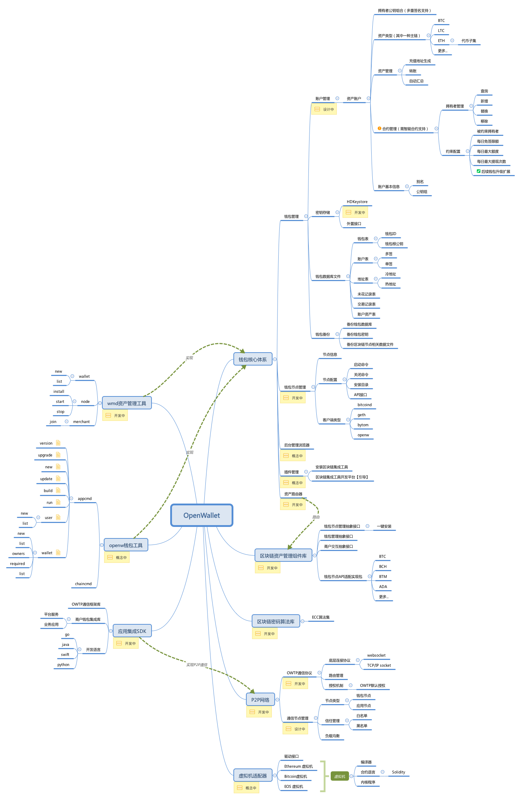
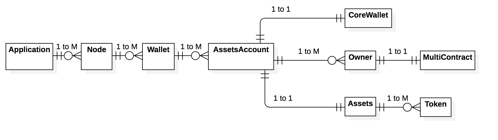
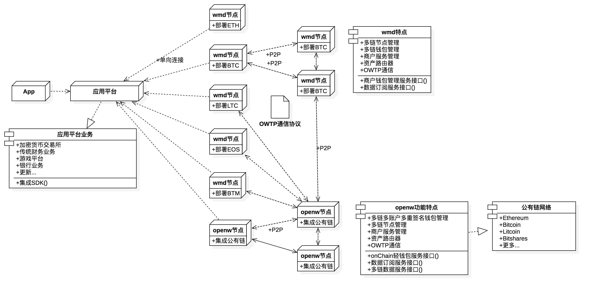
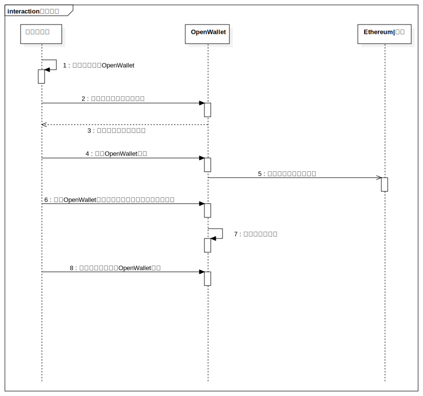
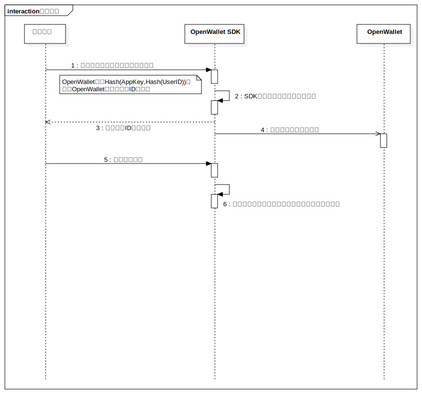
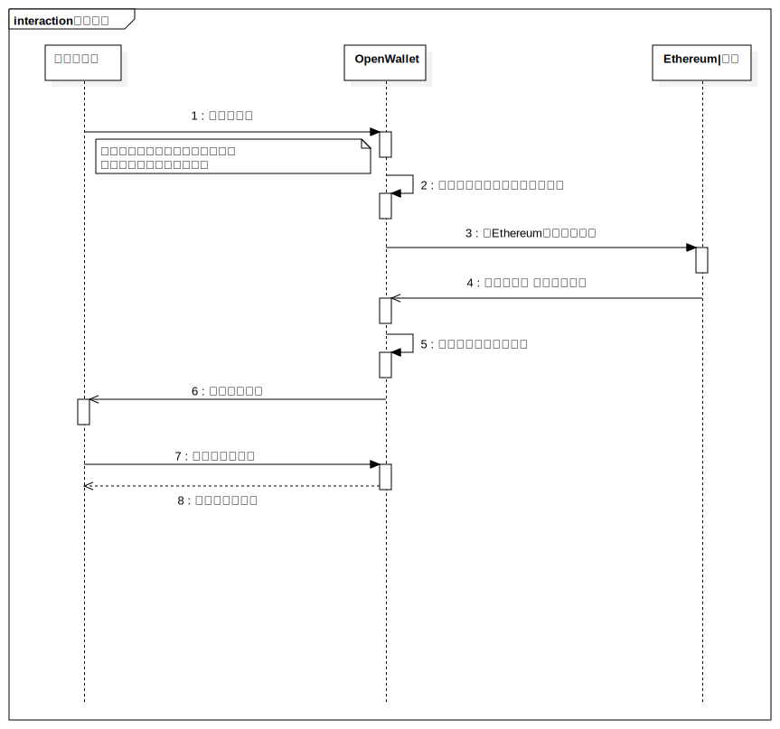
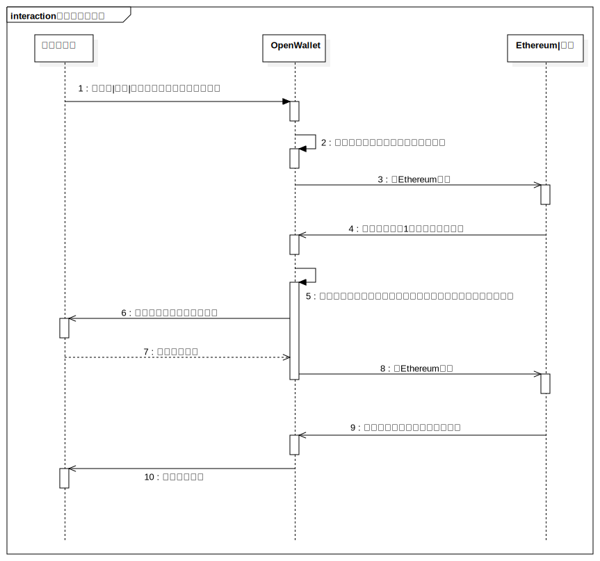
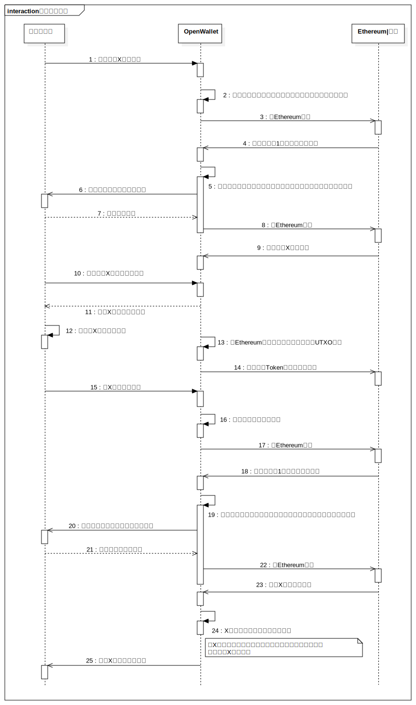
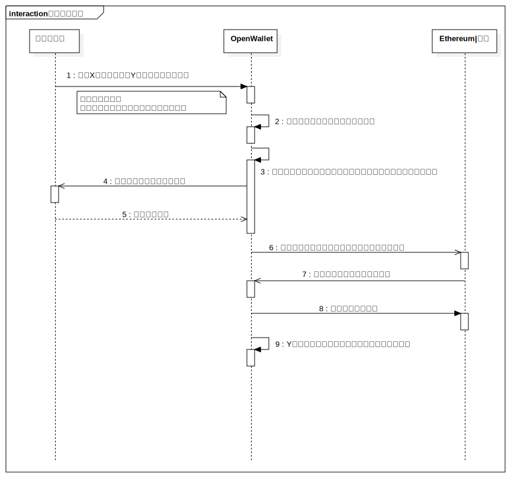
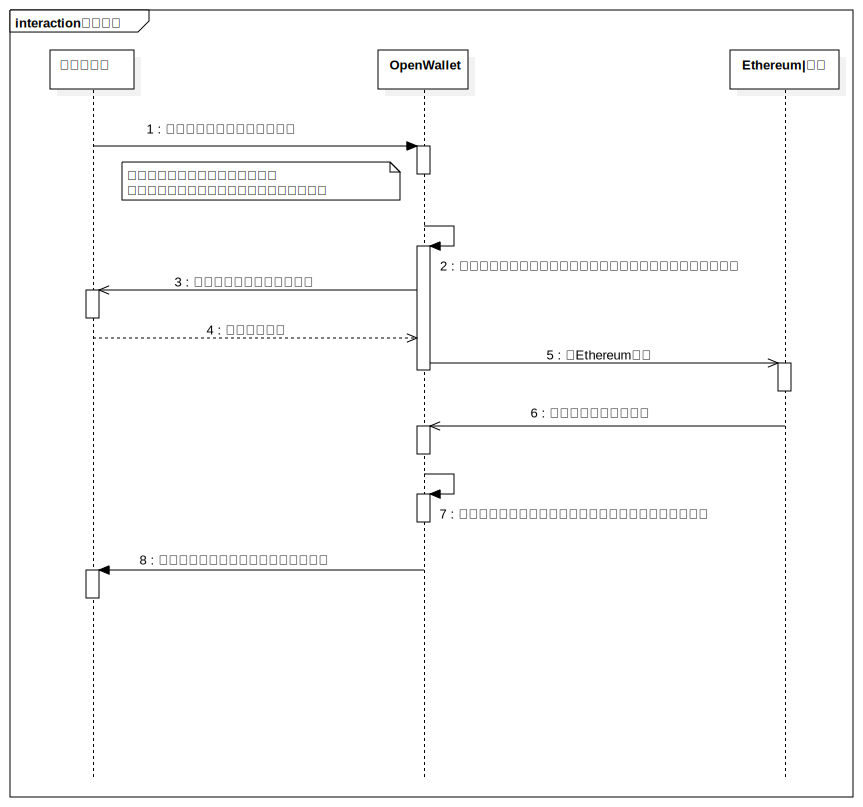

# OpenWallet框架详细设计

## 概述

[TOC]

## 修订信息

| 版本   | 时间         | 修订人  | 修订内容 |
| :---: | :---------: | :---: | :--- |
| 1.0.0  | 2018-03-16 | 麦志泉  | 创建文档 |
| 1.1.0  | 2018-07-10 | 麦志泉  | 架构调整 |

---

## 1. 需求要点

| 序 | 需求                               | 描述                                                                  |
|----|------------------------------------|-----------------------------------------------------------------------|
| 1  | 实现基于点对点通信的分布式网络     | 能够支持大规模的分布式钱包节点部署。                                   |
| 2  | 实现区块链资产管理通用工具         | 能够通过统一的命令，实现涵盖所有的区块链钱包操作。                      |
| 3  | 实现面向商户服务的业务接口         | 能够面向商户平台业务，实现开发者易于集成的接口。                        |
| 4  | 实现多币种多账户多重签名的安全钱包 | 满足多币种多账户的前提，能够支持多重签名的最好钱包解决方案。            |
| 5  | 实现通用的智能合约虚拟机           | 提炼出规范的智能合约模板，能够编译到不同虚拟机，部署到不同的区块链网络。 |
| 6  | 实现支持跨平台的密码算法库         | 满足不同开发平台的需要，能够一套支持大部分区块链密码算法的C组件库。     |

---

## 2. 框架模块

OpenWallet框架划分以下模块：

- **钱包核心体系**——实现了整个框架的钱包体系架构，支持多币种多账户多重签名管理模型。
- **P2P网络**——实现一个基于P2P的分布式网络协议[OWTP通信协议]。负责钱包节点之间，或应用与钱包节点之间的点对点通信。
- **区块链资产管理组件库**——组件库集成了全部区块链资产管理支持。提供标准化的接口，方便上层应用调用。
- **区块链密码算法库**——一个能够满足全部区块链底层密码的密码算法库。给平台移植带来极大的方便。
- **wmd资产管理工具**——提供运维人员安全方便地维护各种区块链钱包节点的命令行工具。提供一键安装钱包，创建钱包，转账等等标准化的指令。
- **openw钱包客户端**——实现了框架核心体系的钱包服务。能够满足日后扩展的区块链资产管理支持。
- **应用集成SDK**——实现多个平台语言的集成SDK，提供接入以OpenWallet框架搭建的应用服务。
- **虚拟机适配器**——通过填写标准化的智能合约表单，能够编译出不同区块链的智能合约代码，部署到不同的区块链网络，实现价值流通。

### 2.1 钱包核心体系设计

OpenWallet的钱包体系可以在已有的区块链节点客户端上，也可以在全新的openw钱包客户端上，建立一层支持多币种多账户多重签名的钱包管理模型。每个钱包采用独立的密钥和数据库来进行资产管理，并且能够在日后使钱包账户支持智能合约。钱包体系有以下规定：

- 每个钱包都以32字节的种子seed作为最根本的数据存储。
- 核心框架针对不同区块链提供单向的衍生seed算法，目的是让用户只备份一个根种子，又能独立分隔各链的钱包种子。
- 核心框架使用HDKeystore方案存储加密后的钱包种子，并附加记录钱包相关的基本信息。
- HDKeystore提供一个用于生成子账户的根公钥，通过确定性的路径生成子账户公钥。由于不同区块链的ECC曲线公式不同，最终生成账户的公钥是会差异的。
- 每个账户只能对应一种区块链资产，若该链支持某种标准代币，则由链的插件功能实现支持。
- 当资产账户是由多个钱包公钥组合创建时，则根据资产的区块链协议，实现多重签名功能，或多账户智能合约。
- 核心框架能否提供多币种账户受限于节点客户端的类型，openw节点可支持多种区块链协议，它就能够给单个钱包提供多币种账户。而其他独立的区块链节点，则只能支持其区块链协议的单币种钱包账户。

#### 钱包核心体系设计下的文件目录规划

我们按照区块链协议分类管理钱包，每个分类独立的`symbol`文件夹，`symbol`是区块链协议的标识ID。

| 参数变量                 | 描述                                                                         |
|--------------------------|------------------------------------------------------------------------------|
| ./conf/                  | 配置文件目录，文件命名 [symbol].ini，openw钱包配置文件为openw.ini              |
| ./data/[symbol]/key/     | 钱包根私钥文件目录，文件命名 [alias]-[ID].key                                 |
| ./data/[symbol]/address/ | 钱包批量地址导出目录，文件命名 address-yyyyMMddHHmmss.txt                     |
| ./data/[symbol]/db/      | 钱包外部数据库缓存目录，文件命名 [alias]-[ID].db                              |
| ./data/[symbol]/backup/  | 钱包备份文件导出目录，以文件夹归档备份，文件夹命名 [alias]-[ID]-yyyyMMddHHmmss |
| ./merchant_data/         | 商户配置及相关数据资料                                                       |

### 2.2 钱包账户实体关系图

- 业务应用Application接入加密货币时，需要部署多个Node，按业务能力，每个Node安装了不同的区块链节点，满足业务量和安全的需求。
- 每个Node根据运行的区块链节点，可以创建1个或多个钱包Wallet。
- 每个钱包根据接入的区块链，可以创建1个或多个该区块链的资产账户AssetsAccount。
- 每个资产账户只对应一种区块链资产Assets。
- 每个资产账户包含一个对应的区块链节点提供的核心钱包数据模型CoreWallet。
- 每个资产账户由1个或多个账户公钥Owner控制，多个时即根据具体的区块链协议，才用多重签名还是多账户智能合约MultiContract。
- 根据具体的区块链协议，每个资产账户可以拥有多个代币Token。

### 2.3 区块链资产管理组件库

区块链资产管理组件库主要工作是实现所有区块链节点的接口适配，按照钱包核心体系的设计原则，抽象出一层标准化的钱包管理接口，供上层业务调用。

#### 钱包管理驱动器——Wallet Manager Driver

我们开发了一个命令行工具叫wmd，全称Wallet Manager Driver，即“钱包管理驱动器”。
其目标就是提供一套标准化的操作指令，驱动区块链资产管理组件库，实现各种区块链资产的钱包管理。其详细设计可查看[《wmd详细设计》](./wmd详细设计.md)。

### 2.4 openw钱包客户端

wmd只能基于各个区块链协议的官方节点客户端之上建立一层钱包管理模型。由于不同的节点客户端提供的接口都不同，很难满足统一的安全，业务使用需求，所以我们开发了openw。openw是一个完全实现了OpenWallet框架的钱包核心体系应用程序，满足多链协议多账户多重签名的钱包管理模型。通过OWTP通信协议，对外能够提供钱包核心业务接口，满足上层不同的业务场景。

openw不一定把所有的区块链协议都集成，它只会集成主流的，市场占有率较大的几种区块链协议。

> 详细设计文档待完善

### 2.5 OWTP通信协议

OWTP协议全称OpenWallet Transfer Protocol，是一种基于点对点的分布式通信协议。
详细查看[《OWTP协议框架设计》](./OWTP协议框架设计.md)

### 2.6 OpenWallet网络服务架构

- 应用平台及其App只要集成OpenWallet-SDK，就能与支持OWTP的节点进行通信。这样任何想接入区块链，使用加密货币进行价值交换的业务就不需要考虑区块链的开发难度，做它该能做好的事情。
- 开发者在其服务器中安装wmd工具，通过标准化指令，完成区块链节点部署，钱包创建，钱包管理等业务。最后通过商户配置，就可接入其需要业务平台，业务通过SDK获取钱包核心数据。
- 分布式地部署各种安装wmd的钱包服务器，就能满足大型的企业加密货币业务需求。为了节省成本，我们最终推荐使用openw钱包客户端组合一起做节点集群。openw把主流的区块链集成一起，大大满足真实的业务需求。

### 2.7 资产路由器

资产路由器实现在OpenWallet网络服务中，通过[节点ID，钱包ID，资产账户ID]能路由到目标资源，并附带具体操作方法和传入参数，可以对资产进行操作，返回处理结果。

针对商户的支付方案，我编写了[《OpenWallet商户接口V1》](./OpenWallet商户接口V1.md)。

## 3. 流程设计[正在重新以下内容]

### 3.1 创建应用流程

1. 应用管理者在自己的服务器或主机，安装OpenWallet工具。
1. 应用管理者通过命令行工具创建应用，生成应用的密钥对，给应用系统访问时生成授权签名用。只要OpenWallet未广播新应用到主链，可以重新创建应用，一旦广播了新应用，则无法修改应用的唯一识别符。
1. OpenWallet按特定算法程序随机生成密钥对，返回给应用管理者。
1. 应用管理者启动OpenWallet节点。
1. OpenWallet节点把新应用状态广播到主链网络。
1. 通过OpenWallet工具快速部署某个区块链协议的节点。这样不需要开发者去了解该种区块链协议的客户端安装和环境搭建。
1. OpenWallet启动后，会持续监听区块链网络，保证数据完整同步。
1. 应用管理者可以开发应用，并通过SDK接入到OpenWallet网络。

### 3.2 用户创建流程

1. 一般业务应用方都有自己的账户系统，他们只要提供用户【唯一键值】给OpenWallet注册用户。OpenWallet生成注册用户ID公式为Hash(AppKey,Hash(UserID))。
1. OpenWallet-SDK为注册用户随机生成密钥对。
1. 返回注册用户OpenWallet的唯一ID和密钥对。
1. 应用授权签名注册用户到主链。
1. 用户通过SDK创建钱包。
1. SDK通过用户根公钥创建分层确定的钱包体系。

> 分层确定的钱包体系，有利用户持续创建新钱包，而不用持续备份密钥，只要用户保存好一个恢复密语和密码就可以恢复所有的钱包账户。
> 是否可以提供用户重置根密钥？理论上是可以的，但如果用户已创建了多个钱包，且有多种资产，转移资产就会非常麻烦。这个需要实现钱包“升级迁移”功能后，通过大量测试后，才能开放给用户。

### 3.3 钱包创建流程

1. 应用创建钱包，提供一个或多个钱包拥有者公钥，应用公钥，初始化资产种类（可选），资产约束（可选）。
1. OpenWallet生成钱包结构化并存储序列数据。
1. OpenWallet选择预设的合约代码，通过Ethereum部署钱包合约到主链。使用Ethereum主链智能合约来控制钱包，这样会更安全方便。因为：1）处于去中心化下，钱包状态未授权下无法篡改；2）对于非Ethereum系资产，我们可以为其编写Token合约，映射其主链的真实地址，通过合约记录真实地址的账户状态，并实现合约驱动，转化成为真实的链上交易。
1. 部署成功，待出块后，获得合约地址。
1. OpenWallet监听到合约地址，完成钱包指向合约地址。
1. OpenWallet推送钱包状态给应用用户。
1. 应用用户访问OpenWallet查看钱包拥有者。
1. OpenWallet返回钱包拥有者列表信息。

### 3.4 钱包拥有者管理流程

1. 应用用户对钱包拥有者进行【新增】【替换】【移除】等操作。
1. OpenWallet验证应用授权和用户授权，执行钱包合约相关的拥有者管理方法。
1. OpenWallet广播执行指令到Ethereum主链网络。
1. Ethereum执行合约完成，OpenWallet监听结果，若为钱包拥有者大于1个，还需要授权，继续等待。
1. 查找钱包未授权的拥有者，加入到请求队列，持续等待一段时间，等待够必要的签名。
1. 推送给其他拥有者请求签名确认。
1. 其他拥有者提供授权签名，确认操作。
1. 确认操作指令广播到Ethereum。
1. 合约收集足够多的确认后，更新拥有者管理列表状态。
1. 推送更新结果给所有拥有者。

### 3.5 钱包资产管理流程

1. 用户钱包创建X种类资产。
1. OpenWallet验证应用授权和用户授权，执行钱包合约相关的创建资产方法。
1. OpenWallet广播执行指令到Ethereum主链网络。
1. Ethereum执行合约完成，OpenWallet监听结果，若为钱包拥有者大于1个，还需要授权，继续等待。
1. 查找钱包未授权的拥有者，加入到请求队列，持续等待一段时间，等待够必要的签名。
1. 推送给其他拥有者请求签名确认。
1. 其他拥有者提供授权签名，确认操作。
1. 确认操作指令广播到Ethereum。
1. 合约收集足够多的确认后，完成资产添加到钱包。
1. 查看钱包X资产的充值地址（资产的充值地址根据公钥组及协议算法生成）。
1. OpenWallet返回钱包X资产的充值地址。
1. 外部用户完成向X资产充值地址充值。
1. 非Ethereum系，监听区块链该地址的UTXO变动。（可行性待考验）
1. OpenWallet更新映射Token合约的账户余额。（可行性待考验）
1. 用户向钱包的X资产发起提现。
1. OpenWallet验证应用授权和用户授权，执行钱包合约相关的创建交易单方法。
1. OpenWallet广播执行指令到Ethereum主链网络。
1. Ethereum执行合约完成，OpenWallet监听结果，若为钱包拥有者大于1个，还需要授权，继续等待。
1. 查找钱包未授权的拥有者，加入到请求队列，持续等待一段时间，等待够必要的签名。
1. 推送给其他拥有者交易单，请求签名确认。
1. 其他拥有者提供授权签名，确认或否决交易操作。
1. 操作指令广播到Ethereum。
1. 合约收集足够多的确认后，提现X资产合约生效。
1. X资产是否需要特定的虚拟机执行？是，则编译为合法交易单，并广播到X资产公链。
1. OpenWallet推送X资产交易单状态给拥有者用户。

> 对于不同链的资产管理，如何做到合约化，自动触发管理是一个开发难点。

### 3.6 钱包约束管理流程

1. 用户操作钱包指定X资产，且指定Y拥有者设置资产约束。约束条件可以是：日免签额度，日最大额度，日发起次数等.
1. OpenWallet验证应用授权和用户授权，执行钱包合约设置资产约束方法。
1. 钱包拥有者大于1个，查找钱包未授权的拥有者，加入到请求队列，持续等待一段时间，等待够必要的签名。
1. 推送给其他拥有者请求签名确认。
1. 其他拥有者提供授权签名，确认操作。
1. OpenWallet验证通过必要的签名数，执行部署资产约束合约。
1. 合约生效，返回约束合约地址。
1. 用户钱包添加资产约束合约。
1. Y拥有者再次发起提现，将先调用约束合约检查。

> 在最底层添加智能合约来约束资产的使用，依靠区块链的去中心化，不可篡改特性可以资产最大的安全保障。但不停的修改合约状态，牺牲很多时间，且消费很多的gas。建议项目后期才实现这个需求。

### 3.7 钱包销毁流程

> 钱包销毁过程实际是一个把全部资产提现的过程。

1. 用户操作钱包发起销毁，并存入要转移的公钥.
1. OpenWallet验证应用授权和用户授权，执行钱包合约设置资产约束方法。
1. 钱包拥有者大于1个，查找钱包未授权的拥有者，加入到请求队列，持续等待一段时间，等待够必要的签名。
1. 推送给所有拥有者资产备份的地址列表，并请求签名进行销毁钱包。
1. 其他拥有者提供授权签名，确认销毁。
1. OpenWallet向Ethereum广播，执行改变钱包为销毁状态。
1. 合约完成钱包资产迁移。
1. 资产转移需要特定虚拟机编译成交易单脚本，广播到其公链。
1. 推送钱包已销毁成功消息到所有拥有者。

### 3.8 钱包升级迁移流程

> 待说明
