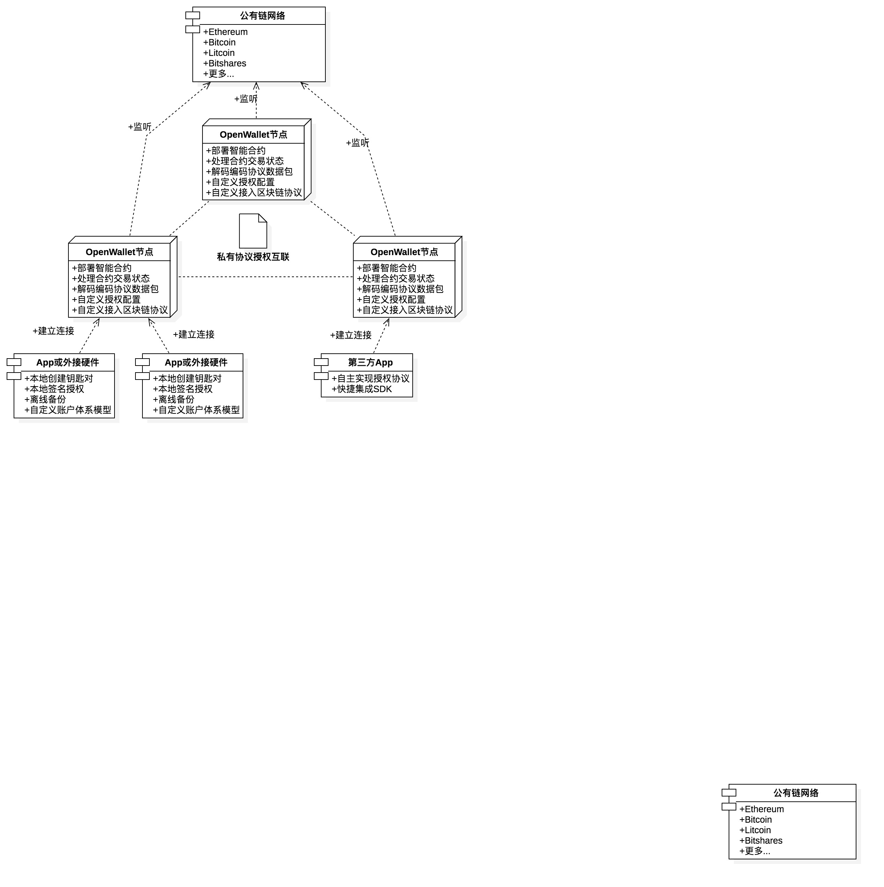

# OpenWallet项目规划书

## 概述

[TOC]

## 修订信息

| 版本  | 时间       | 修订人 | 修订内容 |
|-------|------------|--------|----------|
| 1.0.0 | 2018-03-13 | 麦志泉 | 创建文档 |

---

## 1. 项目目标

目前数字资产种类繁多，虽然都提供钱包客户端，但大多体验较差，无法打通各种资产的管理。为了降低维护成本，提高安全性，此项目目标就是开发一个开放性的钱包系统。系统提供多重签名安全保障，实现多种数字资产管理，并能够随新的数字资产业务，而快速增加接入区块链。最终使大众用户获得轻松、愉快，安全的数字钱包使用体验。

## 2. 需求要点

| 序 | 需求             | 描述                                          |
|----|------------------|-----------------------------------------------|
| 1  | 面向协议服务   | 为了方便钱包管理多种数字资产，系统支持水平扩展区块链协议，监听多种协议网络获取，业务需要的数据。                   |
| 2  | 基于ETH智能合约的业务驱动   | 基于ETH的智能合约，完成多种区块链资产的管理业务。                   |
| 3  | 私有网络集群 | 私有网络部署服务节点，保证钱包多重签名时通信安全。 |
| 4  | 业务与协议解耦 | 在商业化上，每种钱包都有独特的业务，系统架构上要达到业务与区块链协议解耦，以便快速扩展业务。 |
| 5  | 提供多种语言SDK | 为了方便第三方应用接入网络，降低开发难度，提供SDK快速集成是最好最安全的途径。 |

---

## 3. OpenWallet系统架构

### 3.1 系统架构图

### 3.2 公有链网络

每种区块链协议都有一个以上的通信网络，例如Bitcoin，有mainnet主网，testnet测试网，及一些分叉网络。要入接该网络，系统需要监听网络端口，实现解析数据包。要开发一个能够处理多种数字资产的钱包，我们首先要开发一个支持多种区块链协议的网络服务，我称此类系统平台为【面向协议服务】。

### 3.3 OpenWallet节点——面向协议服务系统

OpenWallet节点是整个钱包系统的核心，它具有以下作用：

1. 配置监听多种区块链网络。
1. 解析区块链网络数据包，并按需写入数据库。
1. 部署ETH多重签名智能合约，基于ETH智能合约实现发起其它币种的交易请求。(例如通过ETH智能合约，驱动Bitcoin发起多重签名交易请求)
1. 分布式部署节点，避免中心服务器被攻击至崩溃，导致无法提供服务。
1. 节点与节点之间通过私有协议授权通信，保证多重签名传输过程安全。
1. 提供应用授权接入协议，App或内嵌应用硬件可以安全接入。

### 3.4 私有协议授权

因为OpenWallet服务是分布式部署的，这样可以做到去中心化，避免中心服务器被攻击至崩溃，导致无法提供服务。对等节点之间需要一份私有协议，互相授权连接，保证网络通信安全，也能根据钱包业务处理能力而水平扩展。

另一方面如果部署的节点足够多，并且加入一些共识机制，便形成一条侧链。在多重签名授权情况下，链下交易可以做到快速确认和可申诉撤销，进而避免主链交易出错无法回退的问题。

我们将采用拜占庭将军容错算法建立权益证明共识机制。

### 3.5 钱包App或硬件钱包

钱包App是整个系统的业务执行终端。它具有一下作用：

1. 提供钱包账户体系管理。现行有多种钱包模型，如：单账户模型，HD模型，多重签名模型，冷热模型。App应用平台，负责这个体系的创建，管理和备份。
1. 提供钱包交易管理。钱包App可以不作为全节点运行，但至少需要获取账户关联的交易数据和实时余额，才能发起交易。 并且任何交易的签署最终放在终端上完成，保证私钥不传输在网络中。
1. 不同的钱包App还可能会有其它业务，例如：购物支付，理财借贷。

### 3.6 OpenWallet-SDK

制作SDK组件的目的，是为了钱包App能快速集成服务。解耦业务与协议，让App开发者专注于开发应用业务，不需要关心区块链协议。

---

## 4. 系统框架

> 为何说明开发的是系统框架（Framework）而不是系统应用（Application）。我们一般参与公司项目一般都是应用程序开发，这类项目非常依赖业务需求，不需要通用。而框架是一种非常通用，用于解决某个领域上的程序，现在大部分的应用都建立在各个框架的组合上。因此，我们钱包应用是一种面对多种数字资产管理的业务。OpenWallet既是提供这类业务的解决方案，提供这类框架，而不必要考虑客户具体面对的业务。
> 所以开发者开发过程中需要转变思维，程序开发不要固化在业务层，要考虑扩展性，面向接口开发。

### 4.1 OpenWallet-Server框架

系统框架有如下组件需要开发：

- **加密货币工具库**。用于底层验证不同数字资产交易的合法性。
- **虚拟机插件管理**。负责对多种数字资产的虚拟器进行管理。
- **区块链协议驱动器抽象接口**。负责抽象接口层，统一调用规范，满足调用不同的区块链终端命令。
- **区块链协议驱动器**。这是一个非常好用的组件，就像流行的Java Web框架连接各种数据库一样。开发者无需关心区块链协议，像连接数据库一样使用就是。
- **区块链网络监听器**。负责启动已安装的区块链终端，监听区块链网络。
- **钱包管理服务**。负责管理多重签名账户，处理交易业务。
- **钱包管理服务API**。负责授权App应用接入，推送交易状态数据。
- **钱包服务命令行工具**。PC终端可对服务进行命令操作，修改配置文件。
- **钱包服务浏览器**。负责提供图形界面给管理者查看钱包账户，交易数据，修改服务配置等功能。

> 开发以上组件后，管理者可以在OpenWallet上动态添加数字资产，使用业务应用获得该数字资产区块链的支持。

### 4.2 OpenWallet-SDK框架

- **网络通信组件**。负责OpenWallet节点短/长连接工作，获得线上服务功能。
- **授权配置组件**。负责处理连接节点的授权过程，确保连接上节点是安全授权的App。
- **账户体系组件**。默认给开发者提供一套高可用的账户体系模型，但开发者也可以不采用。
- **加密库组件**。负责处理多种数字资产的底层加密过程。
- **本地缓存组件**。使用本地缓存，可减少网络数据重复加载，提高App运行效率。
- **调试分析组件**。提供调试分析工具，可让开发者在开发环境查看程序执行的各个状态，减少漏洞。
- **示例测试**。提供多个示例场景，方便集成测试。

## 5. 可行性分析

### 5.1 技术难点

1. 虽然我们以对Bitcoin的运作非常熟悉，也有提供多重签名的钱包App案例。但实现Ethereum合约驱动Bitcoin实现执行脚仍没有案例。为实现此案例，我们要对Bitcoin脚本指令深入研究，为Bitcoin开发一款采用Ethereum合约语言的虚拟机。这样就可以使用Ethereum合约来驱动执行Bitcoin合约。以后其它基于Bitcoin原理的数字资产都可兼容。
1. 多种虚拟机插件管理程序目前还没有一个案例，如能实现一个像Visual Studio Code，可自由安装插件的管理程序，未来区块链的应用就非常广范了。
1. 区块链协议驱动器要开发成功的前提是，开发者的非常熟悉主流的区块链协议，并能够抽象出一套通用的接口规范。
1. 数字资产的加密库组件能够开发一套跨平台通用库有一定难度，不但要保证各个平台的编译通过，也考虑不同平台架构对加密算法的影响。核心部分我们采用经过历史考验的开源库，再自己封装一层通用接口。

### 5.2 前景分析

- 区块链目前仍处于开发探索阶段，还没有真正盈利的项目落地。各种概念的炒作会令开发者分心，失去持续研究的初衷。所以我们要坚持【直线法则】，当开发越到困难，应该正面分析问题，找出答案解决问题，而不是绕一个大圈来避免问题发生。我预测【直线法则】会意想不到的给项目带来创新，并且给团队成员带来巨大能力提升。
- 现在的商业项目模式都是面向业务服务，而本项目则是面向协议服务。项目实现区块链协议，能接入业务应用系统，实现价值的传递，这会事未来的一个趋势。
- 区块链开发人才和资源都非常稀缺。在资本扎堆入场区块链，通过参与开发此项目，会给团队带来更大的价值提升，项目运营也会容易成功。

## 6. 开发路线

### 6.1 【第1阶段】OpenWallet框架设计及开发

第1阶段我们应该研究好框架的设计，这样给我们未来集成各个种数字资产带更快的效率。此阶段需要实现：

1. 设计OpenWallet的区块链协议驱动器抽象接口。
1. 设计OpenWallet的数字资产加密库接口。
1. 设计OpenWallet面向App端的授权接口。
1. 设计OpenWallet对等节点的通信接口。
1. 实现OpenWallet网络通信模块。
1. 设计SDK组件框架。
1. 实现SDK与OpenWallet通信接口。

### 6.2 【第2阶段】OpenWallet实现支持Ethereum系

Ethereum已经成为目前区块链领域最大的开发社区。我们首先实现它，将会马上得广泛应用和开发支持。此阶段需要实现：

1. 实现OpenWallet对Ethereum驱动支持。
1. 实现Ethereum及Token的多重签名钱包合约。
1. 实现SDK支持Ethereum协议，解析Ethereum数据状态。
1. 实现Ethereum系的数字资产多重签名钱包应用。
1. 实现OpenWallet可配置区块链的管理功能。

### 6.3 【第3阶段】OpenWallet实现支持Bitcoin系

很多有主链的山寨币都fork于Bitcoin，所以实现Bitcoin可以实现兼容很多流行的山寨币。此阶段需要实现：

1. 实现OpenWallet对Bitcoin驱动支持。
1. 实现支持Ehereum合约语言的Bitcoin虚拟机。
1. 实现Ethereum合约驱动Bitcoin虚拟机运行合约。
1. 实现SDK支持Bitcoin协议，解析Bitcoin数据状态。
1. 实现Bitcoin系的数字资产多重签名钱包应用。

### 6.4 【第4阶段】OpenWallet实现用户管理工具。

此阶段，我们要做到为运维在OpenWallet容易地管理服务，我们主要开发系统维护功能。

1. 实现OpenWallet命令行工具。
1. 实现OpenWallet图形浏览器。
1. 实现OpenWallet分布式部署配置功能。

### 6.5 【第5阶段】OpenWallet社区及开放平台

为了更好地给未来更多的数字资产连接OpenWallet。我们提供社区及开放平台。区块链开发者自主开发驱动引擎，应用开发者自主接入服务。

1. 实现OpenWallet开放平台，编写平台接入资料。
1. 建立管理团队维护开放平台。

### 6.6

1. 产品经理。
1. wmd工具开发，支持众多主流钱包的管理，2人。
1. openwallet商户SDK开发，java-1人。
1. openwallet独立钱包模型，扩根据币种扩展种子，创建分层账户体系。
1. 交易所商户财务服务平台。java-2人。
1. openwallet区块链数据重构。

## 7. 开发团队

| 岗位             | 技能需求                                        | 人数       | 负责领域                                                  |
|------------------|-------------------------------------------------|------------|-----------------------------------------------------------|
| 密码算法工程师   | 精通密码学，擅长分析和设计算法。                  | 2+         | 专攻数字资产底层加密库的组件及智能合约开发                |
| 服务端开发工程师 | 熟练使用C/C++，Go，Java，NodeJs其中一种编写服务端。 | 3+         | 专攻P2P网络开发，实现区块链协议。                           |
| SDK开发工程师    | 熟悉iOS，Android，Mac，Win，Linux等平台的应用开发   | 3+         | 为各个语言开发领域提供SDK组件，Swift，Java，Go，NodeJs等领域。 |
| App开发工程师    | 熟悉iOS，Android，Mac，Win，Linux等平台的应用开发。  | 2+（或外包） | 开发多重签名钱包App。                                      |
| 产品工程师       | 熟悉软件产品开发流程，产品设计。                  | 1 | 专攻去中心化产品设计，设计钱包业务流程 。                   |

## 8. 盈利模式

待完善。